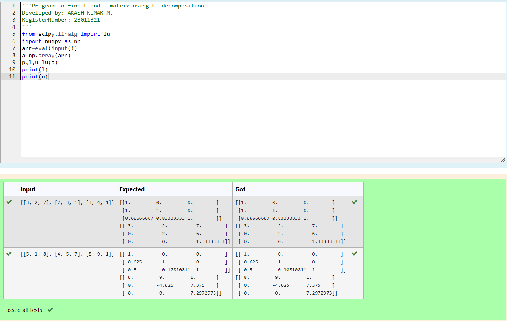
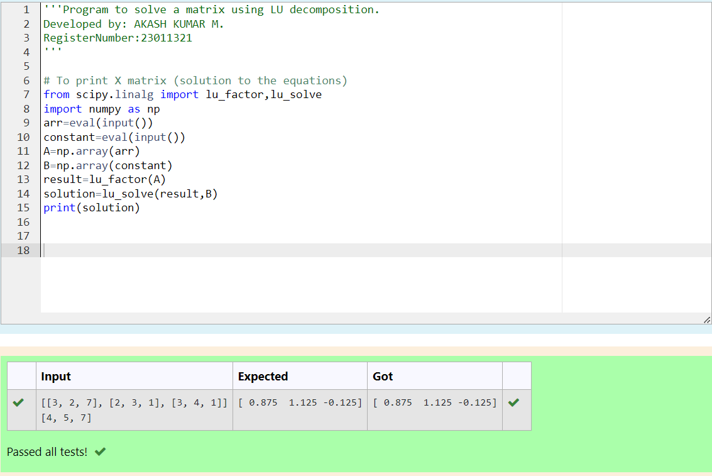

# LU Decomposition 

## AIM:
To write a program to find the LU Decomposition of a matrix.

## Equipments Required:
1. Hardware – PCs
2. Anaconda – Python 3.7 Installation / Moodle-Code Runner

## Algorithm
1. .Import the numpy module and scipy.linalg module to use the built-in functions for
calculation
2. Prepare the lists from each linear equations and assign in np.array() 
3. Perform scipy.linalg.lu() to find the pivot table, lower traingle and upper triangle matrix
4. End the
Program

## Program:
(i) To find the L and U matrix
```python
#Program to find L and U matrix using LU decomposition.
#Developed by: AKASH KUMAR M.
#RegisterNumber: 23011321

from scipy.linalg import lu
import numpy as np
arr=eval(input())
a=np.array(arr)
p,l,u=lu(a)
print(l)
print(u)
```
(ii) To find the LU Decomposition of a matrix
```python
#Program to solve a matrix using LU decomposition.
#Developed by: AKASH KUMAR M.
#RegisterNumber:23011321 


# To print X matrix (solution to the equations)
from scipy.linalg import lu_factor,lu_solve
import numpy as np
arr=eval(input())
constant=eval(input())
A=np.array(arr)
B=np.array(constant)
result=lu_factor(A)
solution=lu_solve(result,B)
print(solution)

```


## Output:




## Result:
Thus the program to find the LU Decomposition of a matrix is written and verified using python programming.

